# PPT AI 在线翻译工具横评
**SmartArt / 表格 / 阿拉伯语 RTL / Think-cell 专业测评**  
评价重点：**翻译后能否直接交付**

---

## 目录
- [快速结论](#快速结论样本内)
- [评测维度说明](#评测维度说明)
- [场景 1：SmartArt 图形翻译](#场景-1smartart-图形翻译)
- [场景 2：表格翻译](#场景-2表格翻译)
- [场景 3：阿拉伯语等 RTL 语言](#场景-3阿拉伯语等-rtl-语言)
- [场景 4：Think-cell 专业图表](#场景-4think-cell-专业图表)
- [适用人群建议](#适用人群建议按真实工作场景)
- [免责声明](#免责声明)

---

## 快速结论（样本内）

| 工具 | 综合评分 | 一句话建议 |
| :--- | :---: | :--- |
| **PrsAI** | **95** | RTL 与 Think-cell 高难场景优势明显，接近可商用交付 |
| 翻译狗 | 75 | 基础能力在线，复杂图表与精细排版有短板 |
| LinnkAI | 65 | 常规内容可用，复杂场景稳定性一般 |
| 全能翻译官 | 60 | 普通文字可翻，复杂版面易失稳 |
| 豆包 | 55 | 适合轻量尝试，不适合正式业务交付 |

**一句话总览**：若目标是“翻译后直接用于客户/管理层汇报”，PrsAI 在本次样本中最接近交付标准。

---

## 评测维度说明

- **翻译完整性**：是否漏译、错译，术语/数字是否完整保留。
- **格式保持性**：版式、字号、段落、对齐、图表结构是否稳定。
- **综合评价**：结合交付可用性给出的结论（完美 / 优秀 / 良好 / 一般 / 失败）。

---

## 场景 1：SmartArt 图形翻译
SmartArt 属于结构化对象，重点考察层级关系、样式继承与布局稳定性。

### 效果对比（图片占位）
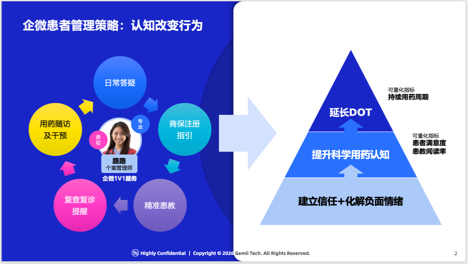
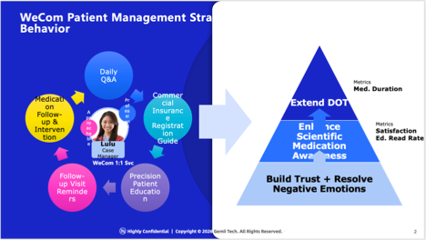
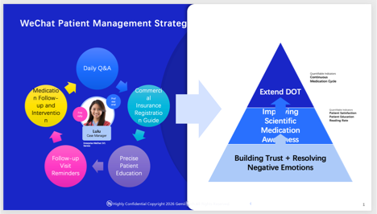

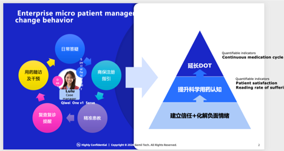
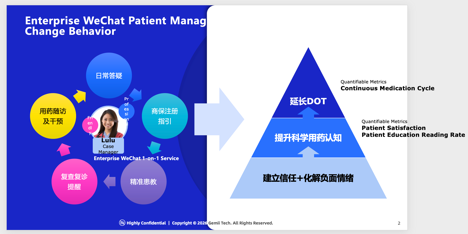

### 星级评分
| 工具 | 翻译完整性 | 格式保持性 | 综合评价 |
| :--- | :---: | :---: | :--- |
| PrsAI | ⭐⭐⭐⭐⭐ | ⭐⭐⭐⭐⭐ | 完美 |
| 翻译狗 | ⭐⭐⭐⭐⭐ | ⭐⭐⭐⭐ | 优秀 |
| 全能翻译官 | ⭐⭐ | ⭐⭐ | 失败 |
| LinnkAI | ⭐⭐ | ⭐⭐ | 失败 |
| 豆包 | ⭐⭐ | ⭐⭐ | 失败 |

> 小结：PrsAI 在结构还原与稳定性方面最优。

---

## 场景 2：表格翻译
表格翻译的典型痛点是列宽错乱、换行异常、字号不一与内容溢出。

### 效果对比（图片占位）
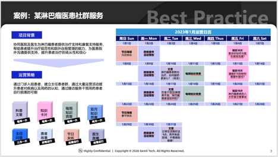
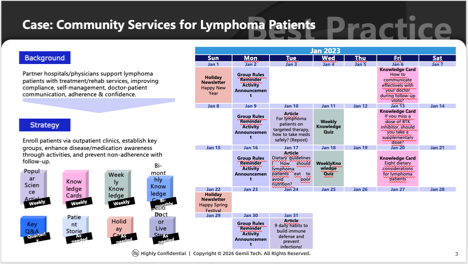
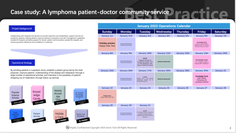
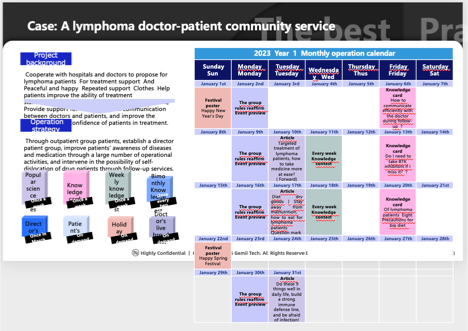
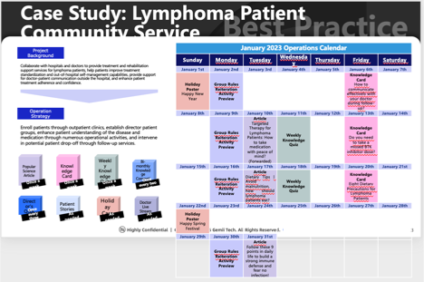
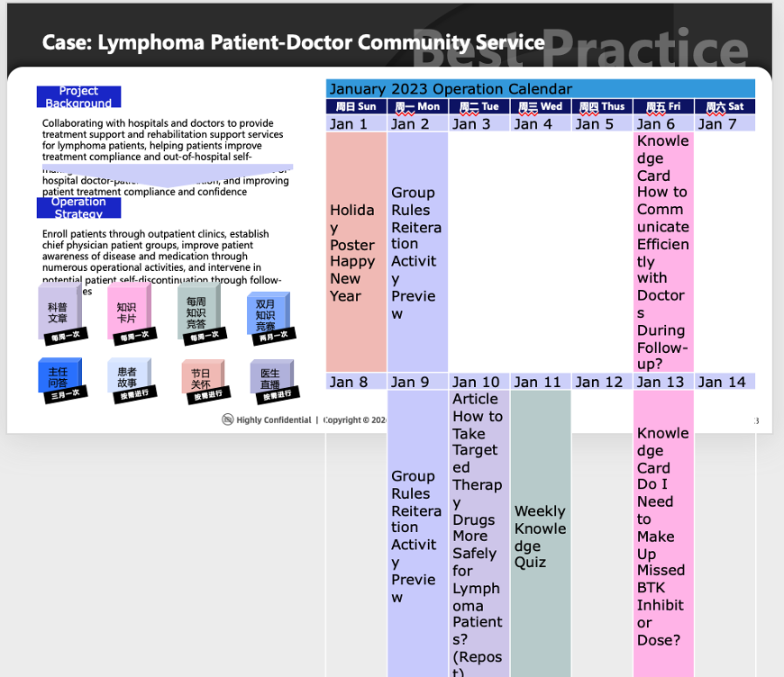

### 星级评分
| 工具 | 翻译完整性 | 格式保持性 | 综合评价 |
| :--- | :---: | :---: | :--- |
| PrsAI | ⭐⭐⭐⭐⭐ | ⭐⭐⭐⭐ | 优秀 |
| 翻译狗 | ⭐⭐⭐⭐⭐ | ⭐⭐⭐ | 良好 |
| 全能翻译官 | ⭐⭐⭐⭐⭐ | ⭐⭐ | 一般 |
| LinnkAI | ⭐⭐⭐⭐⭐ | ⭐⭐⭐ | 良好 |
| 豆包 | ⭐⭐⭐ | ⭐⭐ | 一般 |

> 小结：PrsAI 完成度最高，溢出与版面问题最少。

---

## 场景 3：阿拉伯语等 RTL 语言
RTL（从右到左）是商用交付分水岭，重点考察方向、对齐、标点与数字混排。

### 效果对比（图片占位）
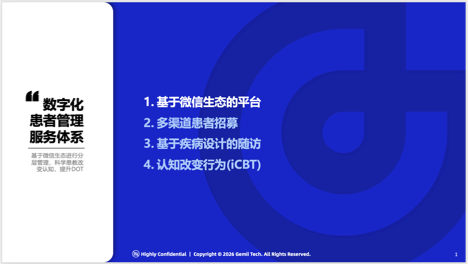
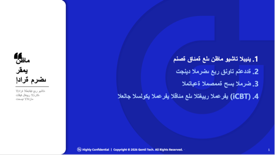
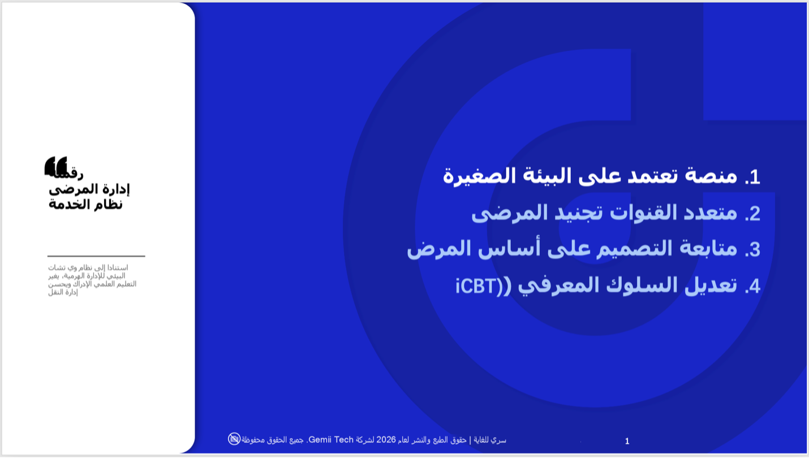
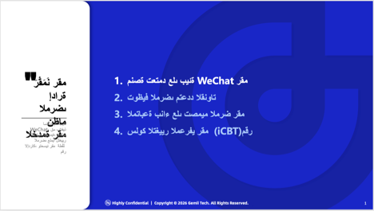
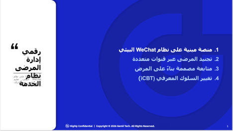
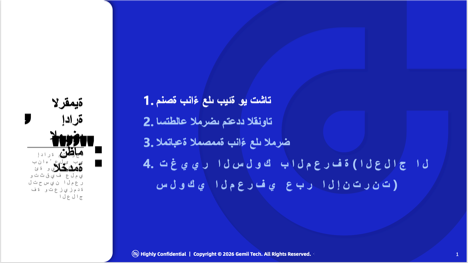

### 星级评分
| 工具 | 翻译完整性 | 格式保持性 | 综合评价 |
| :--- | :---: | :---: | :--- |
| PrsAI | ⭐⭐⭐⭐⭐ | ⭐⭐⭐⭐⭐ | 完美 |
| 翻译狗 | ⭐⭐⭐⭐⭐ | ⭐⭐⭐ | 有缺陷 |
| 全能翻译官 | ⭐⭐⭐⭐⭐ | ⭐ | 失败 |
| LinnkAI | ⭐⭐⭐⭐⭐ | ⭐⭐⭐ | 有缺陷 |
| 豆包 | ⭐⭐⭐⭐⭐ | ⭐ | 失败 |

> 小结：PrsAI 是本次样本中唯一接近“直接交付”水准的方案。

---

## 场景 4：Think-cell 专业图表
Think-cell 是咨询/投行常用图表体系，也是检验专业翻译工具能力的高难场景。

### 效果对比（图片占位）
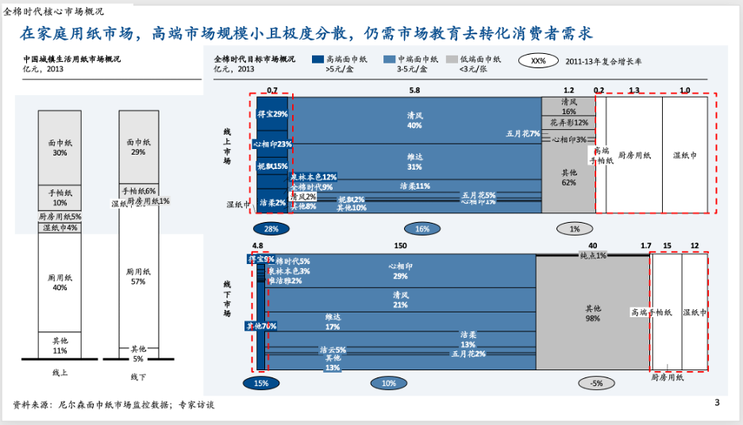
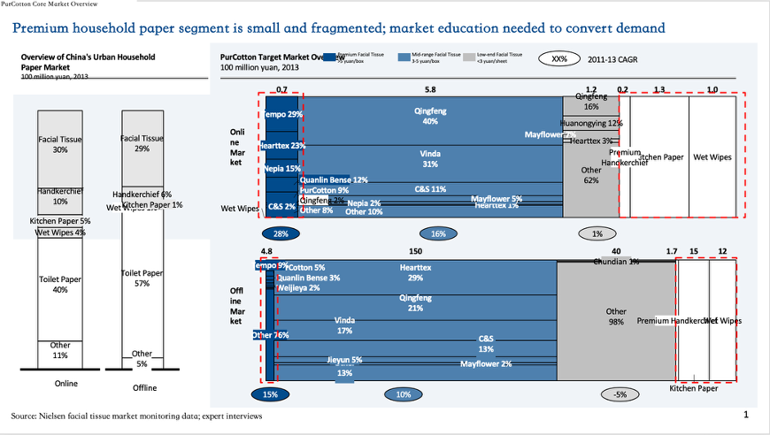
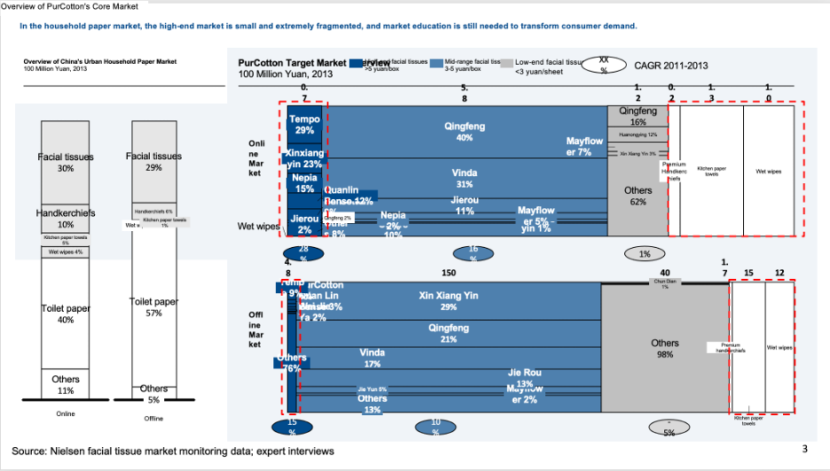
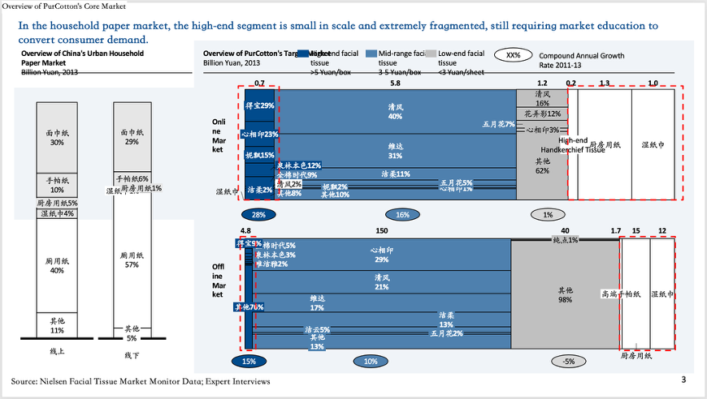
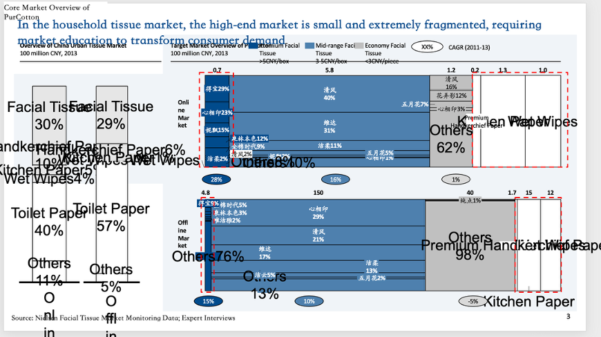
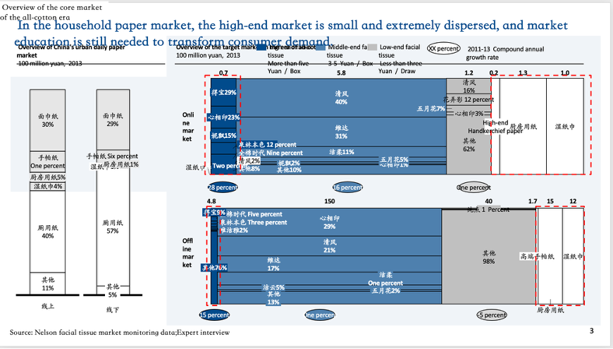

### 星级评分
| 工具 | 翻译完整性 | 格式保持性 | 综合评价 |
| :--- | :---: | :---: | :--- |
| PrsAI | ⭐⭐⭐⭐⭐ | ⭐⭐⭐⭐ | 优秀 |
| 翻译狗 | ⭐⭐⭐⭐⭐ | ⭐⭐⭐ | 一般 |
| 全能翻译官 | ⭐ | ⭐⭐ | 失败 |
| LinnkAI | ⭐ | ⭐⭐⭐ | 失败 |
| 豆包 | ⭐⭐ | ⭐ | 失败 |

> 小结：PrsAI 在 Think-cell 场景达到专业交付标准。

---

## 适用人群建议（按真实工作场景）
- **咨询 / 投行 / 研究 / 战略汇报**：优先选择 Think-cell 与版式保真能力强的方案。
- **金融服务**：优先关注专业图表、数字单位与对齐稳定性。
- **外贸 / 出海团队**：重点关注英文 + 阿语等 RTL 语言的排版正确性。
- **制造业 / 运营手册**：优先选择表格与结构化信息稳定呈现能力强的工具。

---

## 免责声明
结论基于本次样本与场景，结果可能随**文件复杂度、模板/字体、语言对、工具版本**变化。  
建议在正式采购或流程接入前，使用真实交付文件复测。

---
