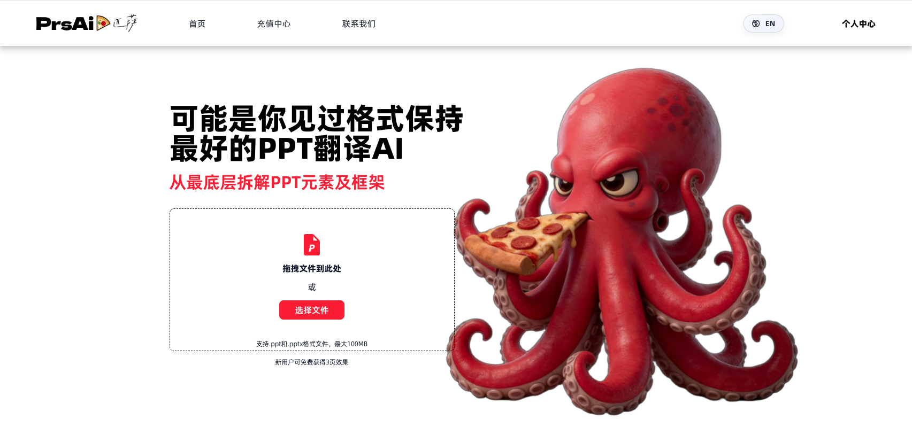
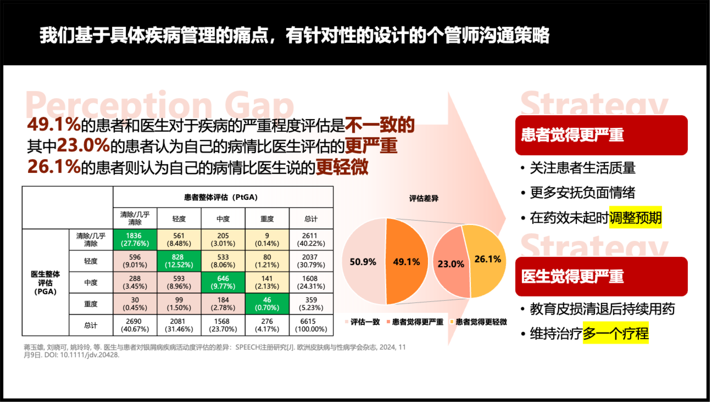

# Prsai_PPT_Translation_Mcp
# PPT Translator Agent

Professional grade LLM-powered PPTX translation agent with constraint-aware text fitting. Translates presentations while preserving formatting, layout, and visual integrity.

## Why This Over Generic LLMs

Generic LLM products (Claude Code, Gemini, GPT, Manus, 豆包, etc.) can translate PPTX but lack fine-grained control over formatting and layout constraints. This agent is purpose-built for high-fidelity results:

- **Semantic-level formatting preservation** — run mapping by meaning, not position. Bold, color, and highlights stay on the correct words even when word order changes across languages.
- **Constraint-aware text fitting** — character budgets derived from actual bounding boxes, with script-aware width ratios and multi-pass overflow resolution.
- **Complex object support** — translates text inside diagrams, tables, and charts, not just shapes and text boxes.
- **Automatic RTL alignment** — auto-adjusts text direction and alignment when translating to/from Hebrew, Arabic, and other right-to-left languages.
- **Third-party plugin support** — partial support for think-cell elements (smart chart objects).

This MCP server exposes two tools:

- `upload_file`: Upload a local file to `https://prsai.cc/api/mcp/file/upload`
- `translate_ppt`: Create a translation task at `https://prsai.cc/api/mcp/ppt/task/add`

`translate_ppt` also returns `outppt_url` in the format `{base_url}/#/progress/{data}` (base domain is read from `PRS_AI_MCP_BASE_URL`).

## Before You Start: Register & Get an API Key

MCP calls (including PPT translation via `translate_ppt`) require an `API Key` for authentication. Please register and sign in at https://prsai.cc/, then request an `API Key` from your account center / console before using this MCP server.

Homepage (drag-and-drop upload, `.ppt/.pptx`, max 100MB):

<a href="https://prsai.cc/"></a>

## Translation Before/After

Example before/after comparison:

| Before (Chinese) | After (English) |
| --- | --- |
|  |  |

Notes:

- The goal is to preserve the original PPT’s layout, fonts, colors, charts, and highlight styles as much as possible.
- Best for “high-fidelity + batch translation” workflows to reduce manual re-layout effort.

## Get an API Key

To use this MCP server, you need to request an `API Key` from PrsAi:

1. Visit https://prsai.cc/
2. Sign up and sign in
3. Open your account center / console, request and copy your `API Key`

Once you have the `API Key`, you can:

- Set the environment variable `PRS_AI_MCP_API_KEY`
- Or pass it as the `api_key` parameter on each MCP tool call

## Configuration

Optional environment variables:

- `PRS_AI_MCP_API_KEY`: default api_key (equivalent to API parameter `mcpToken`)
- `PRS_AI_MCP_BASE_URL`: default `https://prsai.cc`

Resolution order for `PRS_AI_MCP_API_KEY`: tool parameter `api_key` → environment variable `PRS_AI_MCP_API_KEY` → project root `.env`.

Even without environment variables, you can still pass `api_key` per call.

## Run Locally

After installing dependencies, run in this directory:

```bash
python -m prs_ai_staging_mcp
```

Or via the script entry:

```bash
prs-ai-staging-mcp
```

## Third-Party Integrations (Trae / OpenClaw / Codex / ClaudeCode / Coze)

This project is an MCP Server. Any client/tool that supports MCP (stdio mode) can integrate using the same parameters:

- **command**: `uv`
- **args**: `["--directory", "/absolute/path/to/Prsai_Mcp/PPT-Translation-MCP", "run", "prs-ai-staging-mcp"]`
- **env**: `PRS_AI_MCP_API_KEY` (required), `PRS_AI_MCP_BASE_URL=https://prsai.cc` (optional)

## Trae Integration

In Trae’s MCP configuration (Settings → Workspace → MCP, or edit the config file directly), add:

```json
{
  "mcpServers": {
    "prs-ai-staging-mcp": {
      "command": "uv",
      "args": [
        "--directory",
        "/absolute/path/to/Prsai_Mcp/PPT-Translation-MCP",
        "run",
        "prs-ai-staging-mcp"
      ],
      "env": {
        "PRS_AI_MCP_API_KEY": "REPLACE_WITH_YOUR_API_KEY",
        "PRS_AI_MCP_BASE_URL": "https://prsai.cc"
      }
    }
  }
}
```

## OpenClaw Integration

In OpenClaw, add a custom MCP Server (stdio) under “Tools / Plugins / MCP Servers”, and fill in the command/args/env above. Alternatively, you can provide the GitHub repo URL to OpenClaw so it can pull the code and install dependencies automatically.

Example configuration:

```json
{
  "mcpServers": {
    "prs-ai-staging-mcp": {
      "command": "uv",
      "args": [
        "--directory",
        "/absolute/path/to/Prsai_Mcp/PPT-Translation-MCP",
        "run",
        "prs-ai-staging-mcp"
      ],
      "env": {
        "PRS_AI_MCP_API_KEY": "REPLACE_WITH_YOUR_API_KEY",
        "PRS_AI_MCP_BASE_URL": "https://prsai.cc"
      }
    }
  }
}
```

## Codex Integration

Codex can add MCP servers via the CLI, or you can edit `~/.codex/config.toml` (or `.codex/config.toml` in a project). Example for adding a stdio server:

```bash
codex mcp add prsai-ppt-translation \
  --command uv \
  --args --directory /absolute/path/to/Prsai_Mcp/PPT-Translation-MCP run prs-ai-staging-mcp \
  --env PRS_AI_MCP_API_KEY=YOUR_API_KEY \
  --env PRS_AI_MCP_BASE_URL=https://prsai.cc
```

## ClaudeCode Integration

In ClaudeCode’s MCP Servers config (the root field is commonly `mcpServers`), add a stdio server with the same command/args/env as Trae:

```json
{
  "mcpServers": {
    "prsai-ppt-translation": {
      "command": "uv",
      "args": [
        "--directory",
        "/absolute/path/to/Prsai_Mcp/PPT-Translation-MCP",
        "run",
        "prs-ai-staging-mcp"
      ],
      "env": {
        "PRS_AI_MCP_API_KEY": "YOUR_API_KEY",
        "PRS_AI_MCP_BASE_URL": "https://prsai.cc"
      }
    }
  }
}
```

## Coze Integration

If you are using Coze workflows/plugins via HTTP (instead of MCP), you can call the APIs directly:

- Upload file: `POST https://prsai.cc/api/mcp/file/upload` (multipart/form-data: `file` + `mcpToken`)
- Create translation task: `POST https://prsai.cc/api/mcp/ppt/task/add`

```json
{
  "translateLanguage": "en",
  "pptUrl": "URL returned after upload",
  "mcpToken": "YOUR_API_KEY",
  "fileOriginalName": "demo.pptx"
}
```

Progress page: `https://prsai.cc/#/progress/{task_id}`

*Note: Make sure `uv` is installed, and replace the `--directory` path with your local absolute path to `PPT-Translation-MCP`.*

