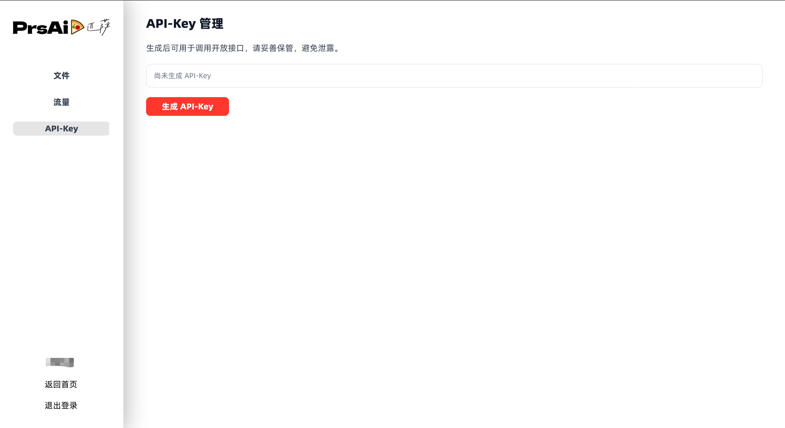

# PPT Translator Agent

专业级 LLM 驱动的 PPTX 翻译智能体，具备约束感知文本适配能力。可在保留格式、版式与视觉完整性的前提下完成演示文稿翻译。

## 为何优于通用 LLM

通用 LLM 产品（Claude Code、Gemini、GPT、Manus、豆包等）虽能翻译 PPTX，但缺乏对版式与布局约束的精细控制。本智能体专为高保真结果打造：

- **语义级格式保留** —— 按含义而非位置进行映射，即使语序因语言变化，加粗、颜色和高亮仍能精准落在对应词汇。
- **约束感知文本适配** —— 基于真实文本框与脚本分析生成字符预算，并提供多种溢出处理策略。
- **复杂对象支持** —— 不仅翻译形状与文本框，还能翻译图表、表格和图示中的文字。
- **自动 RTL 对齐** —— 在希伯来语、阿拉伯语等右向左语言互译时，自动调整文本方向与对齐方式。
- **第三方插件支持** —— 部分兼容 think-cell 等第三方插件（智能图表对象）。

提供两个 MCP 工具：

- `upload_file`：上传本地文件到 `https://prsai.cc/api/mcp/file/upload`
- `translate_ppt`：创建翻译任务 `https://prsai.cc/api/mcp/ppt/task/add`

`translate_ppt` 返回中会补充 `outppt_url`，格式为 `{base_url}/#/progress/{data}`（域名从 `PRS_AI_MCP_BASE_URL` 获取）。

## 使用前必读：注册并获取 API Key

`translate_ppt`（PPT 翻译）等 MCP 接口调用需要 `API Key` 鉴权。请先前往官网 https://prsai.cc/ 注册并登录，在个人中心/控制台申请 `API Key` 后再使用本 MCP。

官网首页（支持拖拽上传，支持 `.ppt/.pptx`，最大 100MB）：

<a href="https://prsai.cc/"></a>
<a href="https://prsai.cc/"></a>

## 翻译效果对比

翻译前/翻译后对比图展示效果：

| 翻译前（中文）                                            | 翻译后（英文）                                           |
| -------------------------------------------------- | ------------------------------------------------- |
|  |  |

说明：

- 目标是尽量保持原 PPT 的版式、字体、配色、图表与重点标注样式不变
- 适用于需要“格式保持 + 批量翻译”的 PPT 场景，减少手工排版调整成本

## 获取 API Key

使用前需要先在 PrsAi Staging 官网申请 `API Key`（用于调用 MCP 接口鉴权）：

1. 访问 <https://prsai.cc/>
2. 注册并登录账号
3. 进入个人中心/控制台，申请并复制 `API Key`

拿到 `API Key` 后，你可以：

- 配置环境变量 `PRS_AI_MCP_API_KEY`
- 或在每次调用 MCP 工具时通过入参 `api_key` 传入

## 配置

可选环境变量：

- `PRS_AI_MCP_API_KEY`：默认 api_key（等价于接口参数 `mcpToken`）
- `PRS_AI_MCP_BASE_URL`：默认 `https://prsai.cc`

`PRS_AI_MCP_API_KEY` 的读取顺序：tool 入参 `api_key` → 环境变量 `PRS_AI_MCP_API_KEY` → 项目根目录 `.env`。

即使不配置环境变量，也可以在每次调用 tool 时传入 `api_key`。

## 本地运行

在该目录安装依赖后运行：

```bash
python -m prs_ai_staging_mcp
```

或使用脚本入口：

```bash
prs-ai-staging-mcp
```

## Docker 部署到服务器运行

如果你想将此 MCP 服务部署到自己的服务器上（以 HTTP SSE 方式提供远程服务，或单纯使用容器化运行），可以直接使用仓库中提供的 Docker 配置。

### 1. 使用 Docker Compose（推荐）

1. 进入 `PPT-Translation-MCP` 目录
2. 修改或创建 `.env` 文件，填入你的 `PRS_AI_MCP_API_KEY`
3. 运行服务：

```bash
cd PPT-Translation-MCP
docker-compose up -d
```

默认会在服务器的 `8000` 端口开启 SSE（Server-Sent Events）服务，你可以在远程 Agent（如 Dify、OpenClaw 等支持 SSE 的工具）里通过 `http://<你的服务器IP>:8000/sse` 连接此 MCP。

### 2. 使用纯 Docker 命令

如果你只需本地容器化运行 stdio 模式（供 Cursor/Trae 调用）：

```bash
docker build -t prsai-ppt-mcp ./PPT-Translation-MCP
docker run -i --rm -e PRS_AI_MCP_API_KEY="你的API_KEY" prsai-ppt-mcp
```

## 第三方接入（Trae / OpenClaw / Codex / ClaudeCode / Coze）

本项目提供的是 MCP Server。只要第三方工具支持 MCP（stdio 方式启动本地进程），就可以按同一套参数接入：

- **command**：`uv`
- **args**：`["--directory", "/absolute/path/to/<你的仓库目录>/PPT-Translation-MCP", "run", "prs-ai-staging-mcp"]`
- **env**：`PRS_AI_MCP_API_KEY`（必填）、`PRS_AI_MCP_BASE_URL=https://prsai.cc`（可选）

## Trae 接入配置

在 Trae 的 MCP 配置中（点击设置 -> Workspace -> MCP，或直接编辑配置），添加如下 JSON 配置：

```json
{
  "mcpServers": {
    "prs-ai-staging-mcp": {
      "command": "uv",
      "args": [
        "--directory",
        "/absolute/path/to/<你的仓库目录>/PPT-Translation-MCP",
        "run",
        "prs-ai-staging-mcp"
      ],
      "env": {
        "PRS_AI_MCP_API_KEY": "请替换为您的真实API_KEY",
        "PRS_AI_MCP_BASE_URL": "https://prsai.cc"
      }
    }
  }
}
```

## OpenClaw 接入配置

在 OpenClaw 的「工具 / 插件 / MCP Servers」新增一个自定义 MCP Server（stdio），填入上面的 command/args/env 即可；或者将github项目地址直接丢给 OpenClaw，由 OpenClaw 自动拉取项目代码，安装依赖。

OpenClaw 配置示例：

```json
{
  "mcpServers": {
    "prs-ai-staging-mcp": {
      "command": "uv",
      "args": [
        "--directory",
        "/absolute/path/to/<你的仓库目录>/PPT-Translation-MCP",
        "run",
        "prs-ai-staging-mcp"
      ],
      "env": {
        "PRS_AI_MCP_API_KEY": "请替换为您的真实API_KEY",
        "PRS_AI_MCP_BASE_URL": "https://prsai.cc"
      }
    }
  }
}
```


## Codex 接入配置

Codex 支持通过 CLI 添加 MCP Server，或直接编辑 `~/.codex/config.toml`（或项目内 `.codex/config.toml`）。你可以按下述方式添加一个 stdio Server：

```bash
codex mcp add prsai-ppt-translation \
  --command uv \
  --args --directory /absolute/path/to/<你的仓库目录>/PPT-Translation-MCP run prs-ai-staging-mcp \
  --env PRS_AI_MCP_API_KEY=你的API_KEY \
  --env PRS_AI_MCP_BASE_URL=https://prsai.cc
```

## ClaudeCode 接入配置

在 ClaudeCode 的 MCP Servers 配置中新增一个 stdio Server（字段名通常也是 `mcpServers`），command/args/env 与 Trae 配置保持一致即可：

```json
{
  "mcpServers": {
    "prsai-ppt-translation": {
      "command": "uv",
      "args": [
        "--directory",
        "/absolute/path/to/<你的仓库目录>/PPT-Translation-MCP",
        "run",
        "prs-ai-staging-mcp"
      ],
      "env": {
        "PRS_AI_MCP_API_KEY": "你的API_KEY",
        "PRS_AI_MCP_BASE_URL": "https://prsai.cc"
      }
    }
  }
}
```

## Coze 接入配置

如果你使用的是 Coze 工作流/插件的 HTTP 调用方式（而不是 MCP），也可以直接请求对应接口：

- 上传文件：`POST https://prsai.cc/api/mcp/file/upload`（multipart/form-data：`file` + `mcpToken`）
- 创建翻译任务：`POST https://prsai.cc/api/mcp/ppt/task/add`

```json
{
  "translateLanguage": "en",
  "pptUrl": "上传后返回的URL",
  "mcpToken": "你的API_KEY",
  "fileOriginalName": "demo.pptx"
}
```

*注意：使用前请确保已安装* *`uv`，并将* *`--directory`* *后的路径替换为您本地实际的* *`PPT-Translation-MCP`* *绝对路径。*
